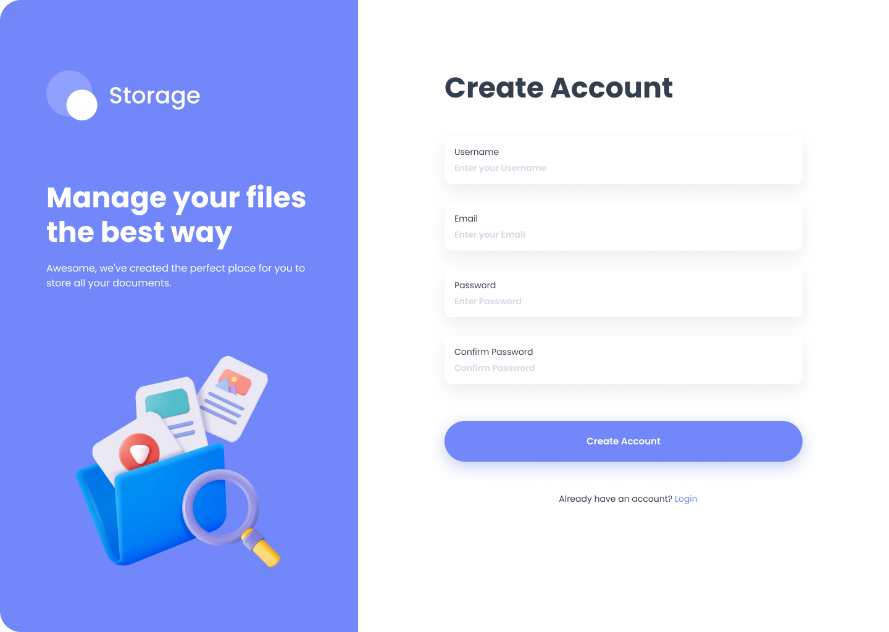
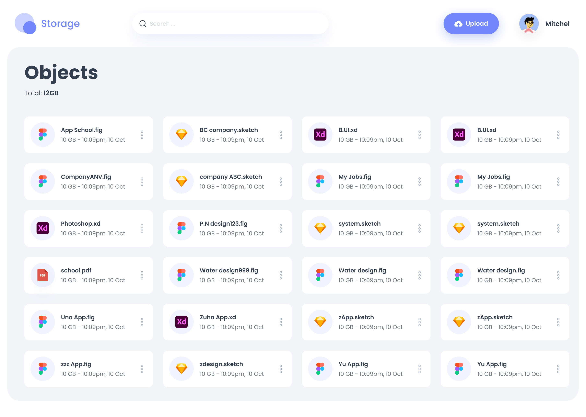
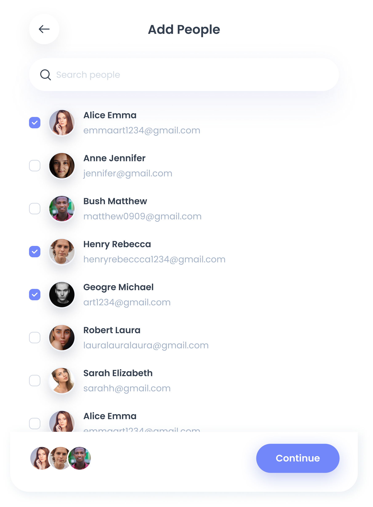
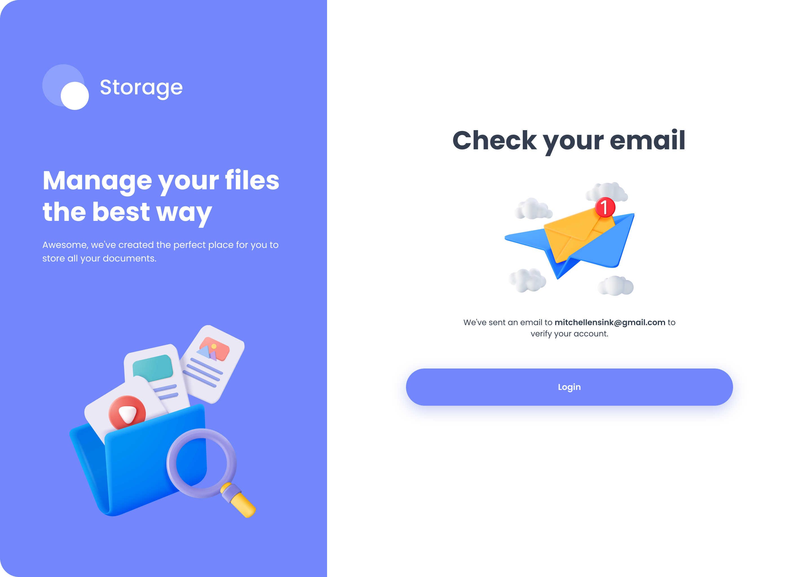

# Object Storage Management Platform

This project is a platform for managing and interacting with object storage. The platform allows users to upload, download, and manage access to objects and supports Arvan Cloud's object storage using the Python SDK.



<p align="center">
  
  
</p>


## Table of Contents

- [About the Project](#about-the-project)
- [Installation](#installation)
- [Usage](#usage)
- [Features](#features)
- [Contributing](#contributing)
- [License](#license)

## About the Project

Object storage is a platform that stores data as objects or entities. It is commonly used as a storage service in the cloud, where each object has a unique identifier, making it easily accessible. In this project, you can connect to Arvan Cloud's object storage using the Python SDK and manage objects efficiently.

## Installation

To set up the project, follow these steps:

1. Clone the repository:
   ```bash
   git clone https://github.com/AliBokaei/WEB-Storage.git
   cd WEB-Storage.git

2. Install the dependencies:
   ```bash
   pip install -r requirements.txt
   ```

3. Configure the project:
   - Add your Arvan Cloud connection details in the `config.py` file.

## Usage

After installation, run the project using the following command:

```bash
python manage.py
```

### Main Page

1. **Header:**
   - Program logo
   - Username and default profile picture
   - Upload button: Allows users to upload files

2. **Main Section:**
   - Object List: Displays all objects the user has access to
   - Access management, download, and delete options for each object

## Features

### Authentication

- **Registration:**
  - Unique username, valid email, and strong password
  - Send a verification email after registration

- **Login:**
  - Login with either email or username and password

### Object Management

- **Upload and Download:**
  - Upload and download objects through the main page
- **Access Management:**
  - Edit user access to objects
- **Delete:**
  - Delete objects by the owner

## Contributing

We welcome contributions to this project. Please discuss any changes, issues, or improvements via Issues before submitting a pull request.

## License

This project is licensed under the MIT License. See the [LICENSE](LICENSE) file for more details.

## Authors
*  [Ali Bokaei](https://github.com/AliBokaei)
*  [Mohammadkazem Harandi](https://github.com/mohammadkahr)

